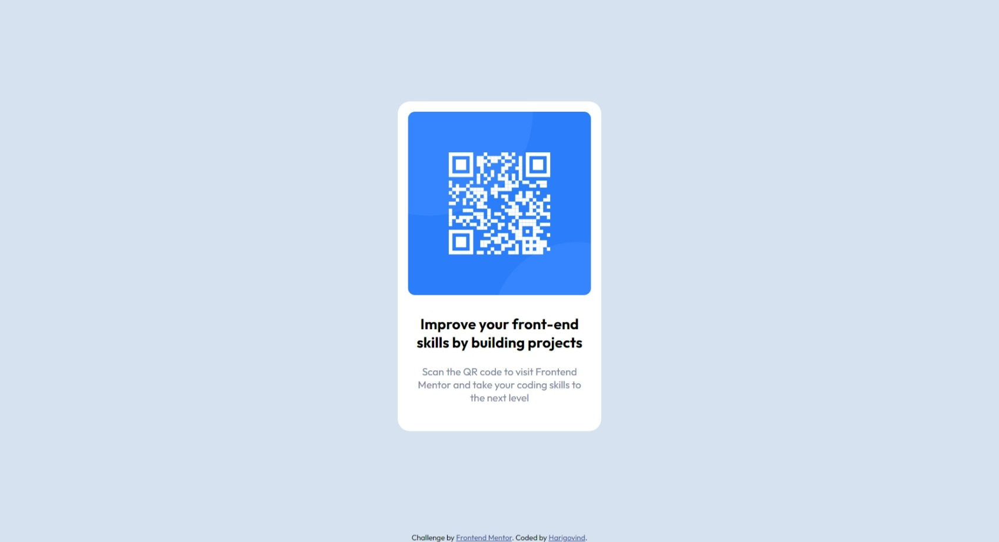

# Frontend Mentor - QR code component solution

This is a solution to the [QR code component challenge on Frontend Mentor](https://www.frontendmentor.io/challenges/qr-code-component-iux_sIO_H). Frontend Mentor challenges help you improve your coding skills by building realistic projects. 

## Table of contents

- [Overview](#overview)
  - [Screenshot](#screenshot)
  - [Links](#links)
- [My process](#my-process)
  - [Built with](#built-with)
  - [What I learned](#what-i-learned)
  - [Continued development](#continued-development)
  - [Useful resources](#useful-resources)
- [Author](#author)
- [Acknowledgments](#acknowledgments)

## Overview

This is the first webpage I built completely by myself. I have only recently statred my web development journey with the help of 'The Complete 2023 Web Development Bootcamp' course by Dr. Angela Yu. I had completed upto the fifth module - Intermediate CSS, where Frontend Mentor was suggested for additional practice. So this is the first challenge I tried. It is a newbie level challenge.
### Screenshot




### Links

- Solution URL: [Github Repository](https://github.com/harigsr1998/Frontend-Mentor-Challenge-1)
- Live Site URL: [Github Page](https://harigsr1998.github.io/Frontend-Mentor-Challenge-1/)

## My process

### Built with

- HTML5
- CSS 3

### What I learned

This challenge was fairly simple. All you had to do was create the design from the screenshots provided. Some style guides, the HTML boilerplate code and instructions were provided. Coding seemed fairly easy. I just looked at the resolution of the screenshots provided and estimated various heights and widths to the best of my ability. This is when I realized that the default height of the body depends on the content inside it. So I had a fun time adjusting paddings and margins to get the height of the webpage equal to that of the provided screenshots. I created the desktop website at first. Tried to use percentages for different values. But I quickly realized that was going to be difficult. So then changed to using pixels. Got everything more or less accurate for the provided width of the webpage. Then converted all values to em instead of pixels to make it a responsive webpage. That was the desktop webpage finished. After that resized the viewport to the mobile version to see if the webpage scaled to the same as the provided screenshot. There was a bit of inconsistency compared to the provided screenshot. So I did a bit of digging to resolve this. Here, I learnt about using media queries, more about responsive design and about dynamic serving. Since I had already applied responsive design and since dynamic serving was beyond my knowledge at this point, I learnt the necessary details about using media queries and applied it to the webpage. This was a bit of a challenge to get right. I have now reached a satisfactory solution. I also learnt it is possible to change the CSS of an HTML tag within a parent tag which has a class, without creating a new class for said specific tag. I have provided an example of this from my code below:

```html
<div class="attribution">
    Challenge by <a href="https://www.frontendmentor.io?ref=challenge" target="_blank">Frontend Mentor</a>. 
    Coded by <a href="https://github.com/harigsr1998">Harigovind</a>.
</div>
```
```css
.attribution {
    font-size: 0.6875rem;
    text-align: center;
    padding-top: 9.3625rem;
}
.attribution a {
    color: hsl(228, 45%, 44%);
}
```

To see some CSS code snippets I'm proud of, see below:

```css
@media(max-width: 375.2px){
    body{
        font-family: 'Outfit', sans-serif;
        text-align: center;
        background-color: hsl(212, 45%, 89%);
        margin: 0;
        padding-top: 5.20625rem;
    }
    img{
        width: 16.875rem;
        margin: 0.9375rem;
        border-radius: 0.625rem;
    }
    .
    .
    .
    .
}
```

### Continued development

I would love to learn more about differnt media queries and how to utilize them. 

One issue I encountered was that the body would never achieve a width of 375px exactly, it would always be 375.2px. This created some problems with the media query and I have not found why this happens or how to solve it. For now I have pretty much placed a band-aid to stop the bleeding. However, I would like to learn how to properly resolve it.

### Useful resources

- [MDN Web Docs](https://developer.mozilla.org/en-US/docs/Web/CSS/Media_Queries/Using_media_queries) - This helped learn about media queries. I have used MDN Web Docs for learning and troubleshooting before and found it very useful. I will be forever using it.
- [Website Builder Expert](https://www.websitebuilderexpert.com/building-websites/how-to-make-website-mobile-friendly/) - This is an amazing article which proved to be  a refernce to understand more about responsive web desing and about dynamic serving.
- [Flowmatters](https://www.flowmatters.com/blog/pros-cons-responsive-design-vs-dynamic-serving-vs-dedicated-mobile-site/) - This blog post too provided a valuable refernce to understand more about responsive web desing and about dynamic serving.

## Author

- Website - [Harigovind](https://harigsr1998.github.io/cv/)
- Frontend Mentor - [@harigsr1998](https://www.frontendmentor.io/profile/harigsr1998)

## Acknowledgments

I would like to thank Dr. Angela Yu for her amazing course 'The Complete 2023 Web Development Bootcamp'. It has started me on a journey I thoroughly enjoy. It is an amazing course where she, in addition to teaching you about Web Development, teaches you to find resources and teach yourself and also gives you tips to stay positive and focused. Frankly, I cannot thank her enough for her help in my journey and could not have asked for a better mentor.
