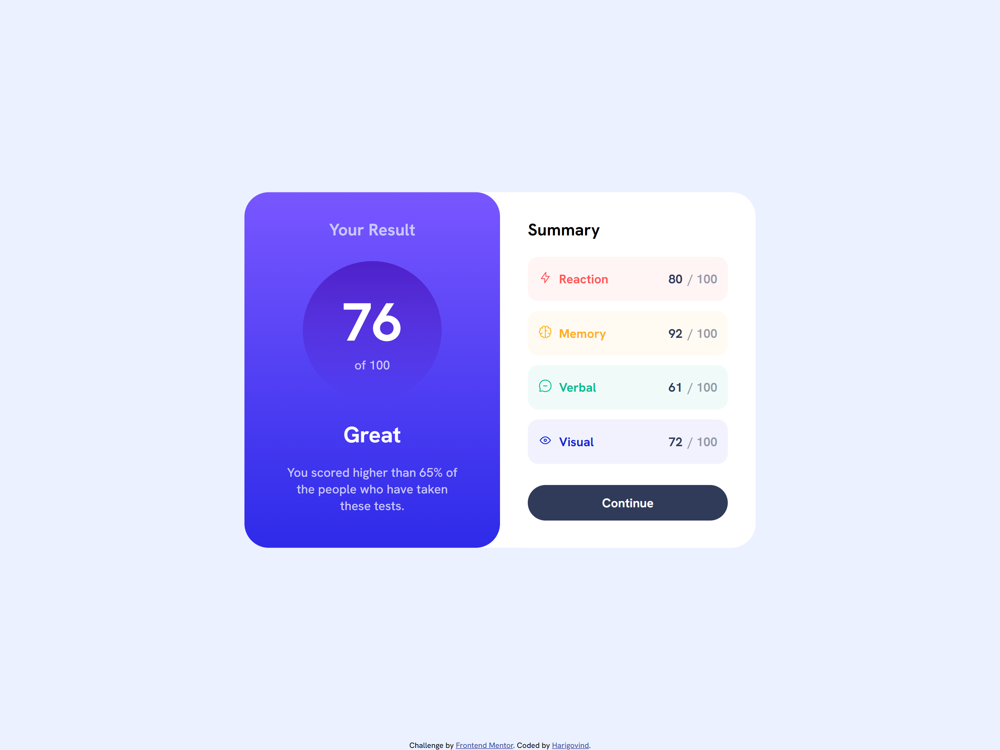
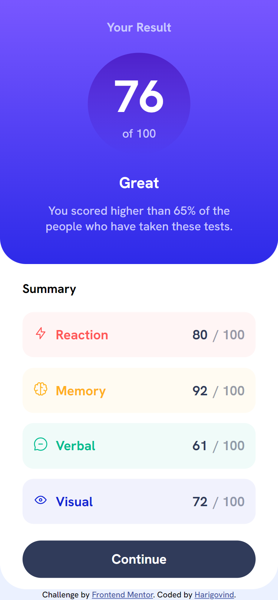

# Frontend Mentor - Results summary component solution

This is a solution to the [Results summary component challenge on Frontend Mentor](https://www.frontendmentor.io/challenges/results-summary-component-CE_K6s0maV). Frontend Mentor challenges help you improve your coding skills by building realistic projects. 

## Table of contents

- [Overview](#overview)
  - [The challenge](#the-challenge)
  - [Screenshot](#screenshot)
  - [Links](#links)
- [My process](#my-process)
  - [Built with](#built-with)
  - [What I learned](#what-i-learned)
  - [Continued development](#continued-development)
  - [Useful resources](#useful-resources)
- [Author](#author)
- [Acknowledgments](#acknowledgments)

## Overview

This is the second webpage I built completely by myself. I have only recently statred my web development journey with the help of 'The Complete 2023 Web Development Bootcamp' course by Dr. Angela Yu. I had completed upto the fifth module - Intermediate CSS, where Frontend Mentor was suggested for additional practice. So this is the second challenge I tried. It is a newbie level challenge.
### The challenge

Users should be able to:

- View the optimal layout for the interface depending on their device's screen size
- See hover and focus states for all interactive elements on the page

### Screenshot




### Links

- Solution URL: [Github Repository](https://github.com/harigsr1998/Frontend-Mentor-Challenge-2)
- Live Site URL: [Github Page](https://harigsr1998.github.io/Frontend-Mentor-Challenge-2/)

## My process

### Built with

- HTML5
- CSS 3

### What I learned

I was expecting this challenge to be a bit difficult for my current level, even though all I had to do was create the design from the screenshots provided. Some style guides, the HTML boilerplate code and instructions were also provided. But it proved to be a bit more tough than I expected. Getting the dimensions correct required quite a bit of work. Some aspects of the design were quite tricky and I had to come up with tricky solutions. Converting dimensions from percentages and pixels to em was challenging again, as elements kept inheriting dimension values from their parents as I converted them. I then had to reconvert some back to percentage and pixels, check to ensure they were correct and then converted them to rem so as to maintain a responsive webpage design. In the end getting everything right was quite a challenging task and one which I enjoyed. I had to learn about CSS gradients and the hsla() function, and about HTML SVG graphics. I also had to do a bit of revision on the CSS border-radius property. To see some CSS code snippets I'm proud of from this challenge, see below:

```css
.container-full{
    width: 46rem;
    margin: 0 auto;
    position: relative;
    border-radius: 2.3125rem;
    background-color: hsl(0, 0%, 100%);
}
```

### Continued development

Once again I encountered the issue of the the body never achieving a width of 375px exactly. It would always be 375.2px. However, due to the difference in how I configured @mdeia queries this did not create a problem this time. Another aspect is the tricky solution I had to implement, which I have shown above. I doubt if that is the right or straight way to do it and I wonder if there exists better or different solutions that I haven't learnt yet. I would love to explore more in this area.

The resources for this challenge also included some images as .svg files, fonts as .ttf files and some data as a .json file. I integrated the .svg and .json files into the webpage by directly typing in their code and linked the fonts from Google Fonts. In the future I would like to learn to integrate these resources by linking them and not typing in the code.

### Useful resources

- [W3Schools](https://www.w3schools.com/css/css3_gradients.asp) - This helped me learn about CSS gradient, the hsla() function, HTML SVG graphics and revisiting the CSS border-radius property.I have used W3Schools before and will continue to use it as I find it imformative and very useful.

## Author

- Website - [Harigovind](https://harigsr1998.github.io/cv/)
- Frontend Mentor - [@harigsr1998](https://www.frontendmentor.io/profile/harigsr1998)

## Acknowledgments

I would like to thank Dr. Angela Yu for her amazing course 'The Complete 2023 Web Development Bootcamp'. It has started me on a journey I thoroughly enjoy. It is an amazing course where she, in addition to teaching you about Web Development, teaches you to find resources and teach yourself and also gives you tips to stay positive and focused. Frankly, I cannot thank her enough for her help in my journey and could not have asked for a better mentor.
